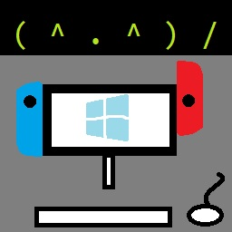

# switch-remote-play

Let the switch remotely play PC games (similar to steam link or remote play)

This project is inspired by the github project [In-Home-Switching](https://github.com/jakibaki/In-Home-Switching) and [SkyNX](https://github.com/DevL0rd/SkyNX). The goal is to make a convenient streamer/client application to be used to remote play PC games on the switch.

[In-Home-Switching](https://github.com/jakibaki/In-Home-Switching) and [SkyNX](https://github.com/DevL0rd/SkyNX) already offer the ability to do so, however there were some convenience features missing that I wanted to add. I also recently was studying multi-threading and when I saw the code, I thought 'this is the perfect chance to try writing it in C++'.

## Getting Started

For instructions and help, please see the [wiki](https://github.com/Moehammered/switch-remote-play/wiki).

You can also visit the [gbatemp release thread](https://gbatemp.net/threads/switch-remote-play-stream-your-pc-to-your-switch.579541/) to share and interact with other users, or get help with any issues you might have.

## Features

- [x] No system crashing when going to sleep (stream will disconnect though and application is closeable)
- [x] Desktop application to host remote connection stream
- [x] Stream input from the switch to remote connection
- [x] Stream audio from remote connection to the switch
- [x] Automatically connect switch and PC stream applications
- [x] Automatically mute PC when audio is streaming to the Switch
- [x] Allow manual configuration of switch to PC connection
- [x] Disconnect / Reconnect stream at will
- [x] Toggle Input Mode to Mouse
- [x] Toggle Input Mode to DS4(PS4) controller
- [x] Toggle Input Mode to Xbox controller
- [x] Rich configuration options for h264 CPU encoder
- [x] Rich configuration options for h264 AMF encoder (AMD hardware encoder)
- [ ] Multiple controller support
- [ ] Touch screen emulate mouse support
- [ ] Controller gyro support
- [ ] Controller rumble support

## Switch-Project

This project consists of an application written for the switch that will decode stream data received from [FFMPEG](https://github.com/FFmpeg/FFmpeg) and send its input to an application to emulate a controller. The rendering is done with SDL2 and the project is written in C++.

### Compatibility

- Only **Atmosphere CFW** is supported. SX OS is not officially supported
- Program is compiled with latest LibNX libraries (v4.1.3 at the time of this writing)
  - Means it will work with newer firmwares

## Windows-Project

This project consists of an application written for Windows that will launch an FFMPEG stream to encode and send data. The application, after launching the [FFMPEG](https://github.com/FFmpeg/FFmpeg) stream, will then listen to receive input data and emulate a controller via the [ViGEm Client SDK](https://github.com/ViGEm/ViGEmClient). The [ViGEm Client SDK](https://github.com/ViGEm/ViGEmClient) expects the [ViGEm Bus Kernel Driver](https://github.com/ViGEm/ViGEmBus) to be installed on the machine in order to work. For more info on the kernel driver code see the [ViGEmBus](https://github.com/ViGEm/ViGEmBus) github page. For the driver installation, see the [ViGEmBus Releases](https://github.com/ViGEm/ViGEmBus/releases) page.

The Windows project is also written in C++ and uses Winsock to do socket communication with the switch application.

## Mac-Project

See the 'mac-readme' file located in the repo's instructions/mac folder.

## Thanks

- [jakibaki](https://github.com/jakibaki) for the original [In-Home-Switching](https://github.com/jakibaki/In-Home-Switching) switch application
- [DevL0rd](https://github.com/DevL0rd) for the updated streaming application [SkyNX](https://github.com/DevL0rd/SkyNX)
- [FFmpeg](https://www.ffmpeg.org/) for an exhaustingly extensive library
- [nefarius](https://github.com/nefarius) for the [ViGEm Client SDK](https://github.com/ViGEm/ViGEmClient). It's such a nice SDK/library to use
- [rdp](https://github.com/rdp) for [screen-capture-recorder](https://github.com/rdp/screen-capture-recorder-to-video-windows-free). Made streaming audio via FFmpeg on PC very easy
- [SwitchBrew](https://switchbrew.org/wiki/Main_Page) for [libNX](https://github.com/switchbrew/libnx)
- [devkitPro](https://devkitpro.org/) bloody legends for letting us have a toolchain to compile stuff for the Switch
- [SciresM, TuxSH, hexkyz, and fincs](https://github.com/Atmosphere-NX/Atmosphere) for Atmosphere. Absolute madlads these lot are. Also a shoutout to the champs that help contribute to the repo.
- Jonathan Dearborn for SDL_FontCache
- [cucholix](https://gbatemp.net/members/cucholix.411991/) for the app icon :)

## Licence

GPLv3, so please follow the open source licence and be a nice bloke. If you use parts of this project or expand on this project, make it open source. Cheers mate. (You can read more about the GPLv3 licence [HERE](https://tldrlegal.com/license/gnu-general-public-license-v3-(gpl-3)) and [HERE](https://choosealicense.com/licenses/lgpl-3.0/))

The [ViGEm Client SDK](https://github.com/ViGEm/ViGEmClient) uses an [MIT](https://tldrlegal.com/license/mit-license) licence and it has been included with the Windows project. (The Windows project itself is still licensed under [GPLv3](https://tldrlegal.com/license/gnu-general-public-license-v3-(gpl-3)))
