# How-To Instructions

## Table of Contents
- [Install](#install)
  - [Switch Install](#switch-install)
  - [PC Install](#pc-install)
- [Usage](#usage)
  - [PC Usage](#pc-usage)
  - [Switch Usage](#switch-usage)
- [Help it's not working](#help-its-not-working)
  - [Firewall](#firewall)
  - [Network](#network)
  - [PC IP - Figuring out Network Configuration](#pc-ip---figuring-out-network-configuration)
  - [Stuck on Pending Connection](#stuck-on-pending-connection)
  - [Virus Thread Detected](#virus-threat-detected)

## Install

### Switch Install

1. Have **[Atmosphere](https://github.com/Atmosphere-NX/Atmosphere/releases/latest)** CFW on your Switch *(other firmwares are untested)*
2. Copy the *switch* folder to the root directory of your Switch SD card

### PC Install

1. Have Windows 10 64 bit

2. [Download and install **Screen Capture Recorder to Video Windows free v0.12.11**](https://github.com/rdp/screen-capture-recorder-to-video-windows-free/releases/tag/v0.12.11)

3. [Download and install **ViGEm Bus v1.16.116**](https://github.com/ViGEm/ViGEmBus/releases/tag/setup-v1.16.116)

4. Copy the *switch-remote-play-host* folder from the **PC** folder to anywhere you like (Downloads, Desktop, Documents, etc...)

## Usage

### PC Usage

0. Make sure your PC and your Switch are connected on the **same network**
    - If you have a **5GHz WiFi network** try to make sure your Switch and PC are connected to it

    

1. Make sure the *ffmpeg.exe* program is located in the same folder as the *switch-remote-play-host.exe*
    - *ffmpeg.exe* is used to stream the audio and video to your switch
    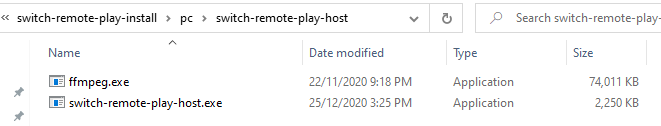

2. Open the *switch-remote-play-host.exe* program
    - If you get a **Windows Firewall** prompt, make sure to **ALLOW** the program access
      - If you don't allow access, the Switch will be unable to connect. You will have to **manually** add *switch-remote-play-host.exe* to the **Windows Firewall** rules to fix this
    - Once it is open, you should see *"Ready to receive a connection from the switch..."* and *"Waiting for connection to server"*
    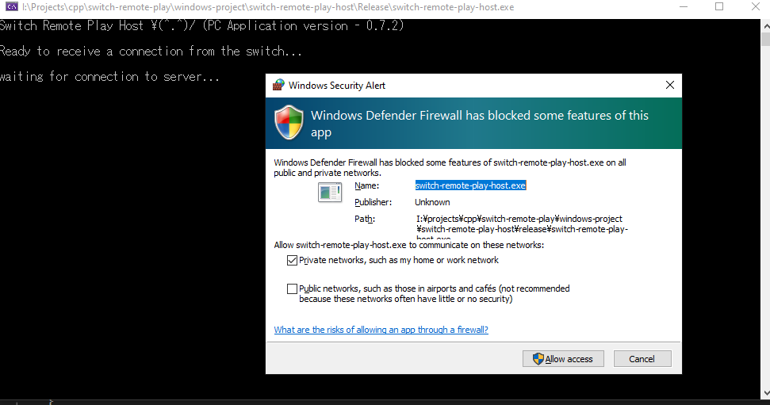

3. The *switch-remote-play-host.exe* program will output basic diagnostic info. It will also output your **network configuration**. This is required to setup auto Network Discovery.
   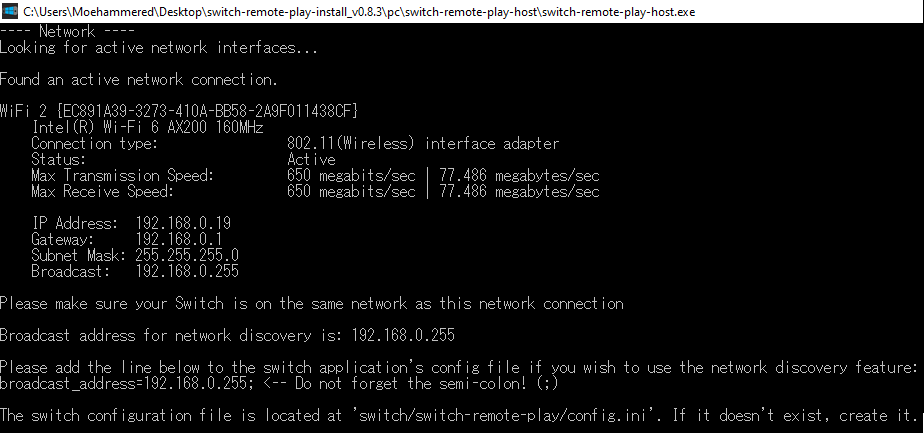
   - Please follow the instructions in the console to configure network discovery.
   - If the network diagnostic output fails or reports an issue, you will only be able to connect via Manual IP Mode.

### Switch Usage

0. Make sure **Flight Mode is OFF** and your Switch and PC are connected on the **same network**
    - If you have a **5GHz WiFi network** try to make sure your Switch and PC are connected to it

1. Open the *switch-remote-play* app
   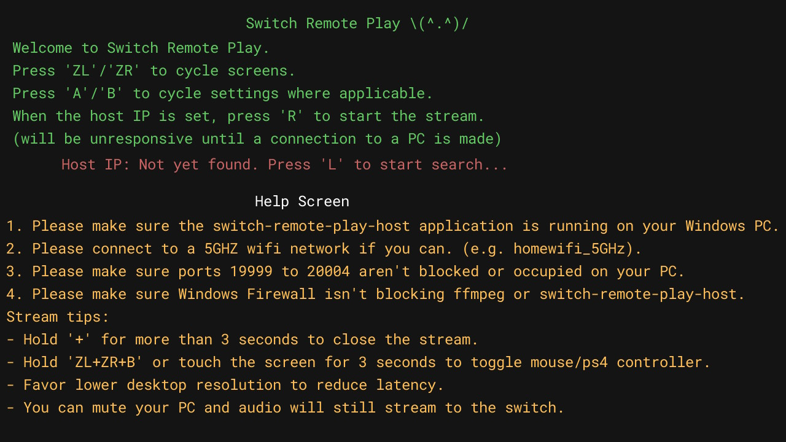

2. Press **'ZL/ZR'** to move between configuration screens. There is an **Encoder Configuration** screen that lets you control the video stream options. Play around with them to control quality and latency.
   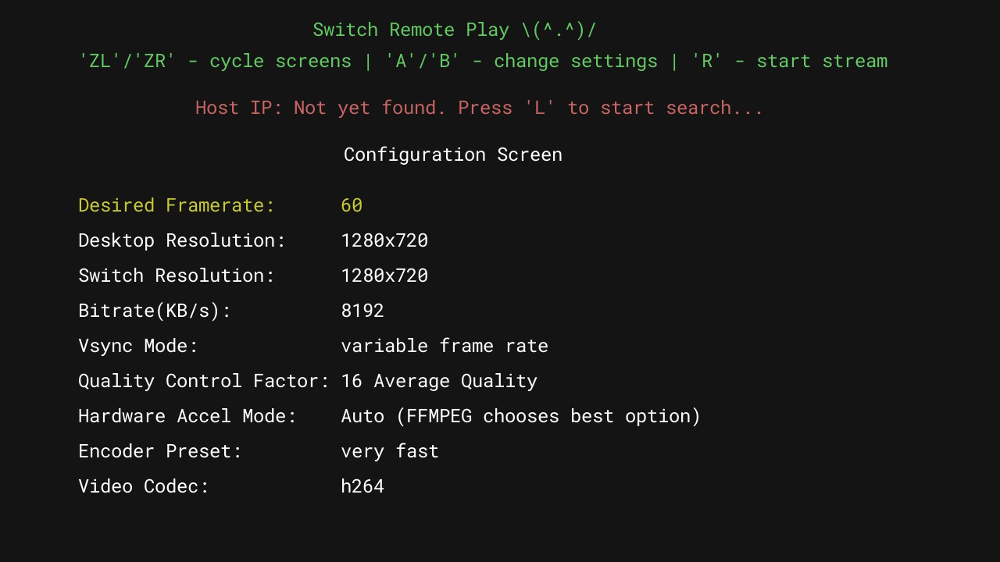
   - **NOTE:** Quality and latency is entirely dependent on your CPU and network. Please experiment with the configuration options to find what works for your machine.

3. Press **'L'** to start network discovery
    - **NOTE:** If your network subnet is not 255.255.255.0 and your default gateway is not 192.168.0.1 then you will be required to add a configuration option to the switch application's config file.
      - If the **network diagnostic output reported an error** or issue then you can **only use Manual IP Mode**.
      - If you don't know what all this is please go to the [figure out PC IP section](#pc-ip---figuring-out-network-configuration) if network discovery or Manual IP doesn't work.
    - **You should see your PC's IP address (*'Host IP: 192.168.XXX.XXX'* in green)**
    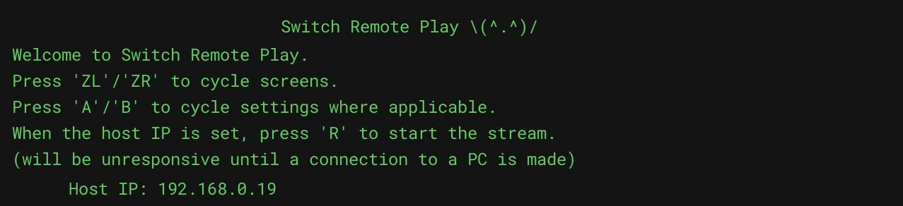
    - **And you should see your Switch's IP on the PC application**
    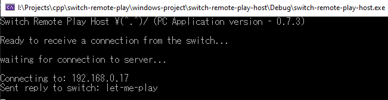
    - **If this doesn't work**, or stays stuck on *'Searching'* please check the [firewall section](#firewall)
    

4. Press **'R'** to **connect**
    - Once connected, the default control mode is **'Mouse'** mode.
      - L = left click, R = right click, analogs for movement
    - **Hold** the **touch screen** or **'ZL+ZR+B'** for more than **3 seconds** to switch to PS4 controller mode. You'll hear a sound on your PC play.

5. To **stop** the stream, hold **'+'** button for more than 3 seconds

## Help it's not working

### Firewall

Please confirm that the Windows Firewall rules **allows both ffmpeg and switch remote play host** to access your private (and/or public network if you're using McDonalds wifi haha)

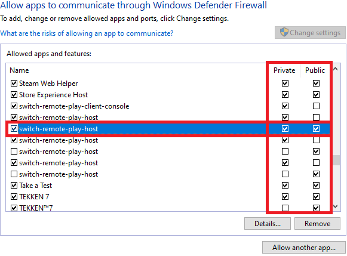

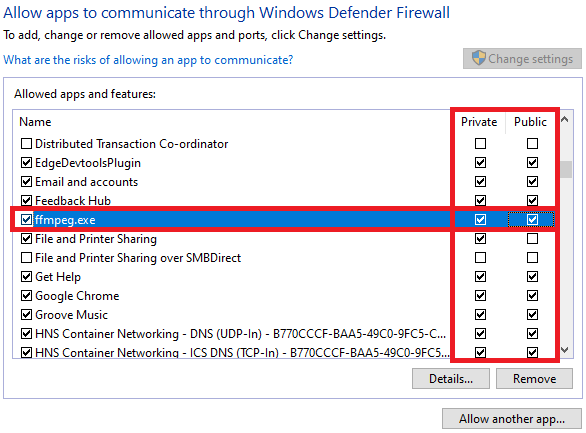

### Network

Please make sure your switch and PC are on the same network. If you try to perform a network search and your PC IP doesn't show up, then it means they're not on the same network, the broadcast address hasn't been configured, or they're being blocked by Windows Firewall.

Please confirm by trying to perform the network discovery in the switch app. **You should see your Switch display your PC's IP and your PC display your Switch's IP.**

If you perform the network discovery feature and you don't see your Switch's IP on the PC application, Windows Firewall is blocking it, you're on a different network than your PC, your router is blocking the ports, or the broadcast address configuration option doesn't match, or a PC app is already using the ports 19999 - 20004.

### PC IP - Figuring out Network Configuration

The PC application figures out the subnet mask and broadcast address of your active network connecton. It is listed in the console on startup.

It does so to filter out network traffic when listening for the switch to broadcast itself for network discovery. **The PC application defaults to a subnet mask of 255.255.255.0 and a gateway of 192.168.0.1 if network diagnostic output fails**.

- If you want to connect through **Manual IP Mode**, use the **IP Address** that shows up for you in the **Network** output of *switch-remote-play-host.exe*.
- If you want to connect automatically through **Network Discovery**, you will need to add the line the program mentions in the **Network** output to your Switch app's configuration file.
  - **Location:** *'sdcard/switch/switch-remote-play/config.ini'*
    - If it doesn't exist, you can create it yourself

    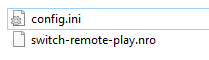

  - **Broadcast Address:** *192.168.0.255* (<-- your broadcast address will be shown to you when you run *switch-remote-play-host.exe*)

    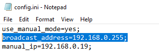

If the above doesn't work or the Network diagnost output reports an issue, then open **Powershell** or **command prompt** and type ***ipconfig*** then press *Enter*. You should see a list of network interfaces. Look for the one that has **IPv4 Address, Subnet Mask, and Default Gateway**.

- Use the **IPv4 address** to connect via **Manual IP Mode**.

### Stuck on Pending Connection

Please make sure ffmpeg is not being blocked by Windows Firewall.

Please make sure that **if you're using manual IP mode**, that your **Switch and PC are on the same network** and that your PC IP is correct and that ffmpeg is not being blocked by Windows Firewall.

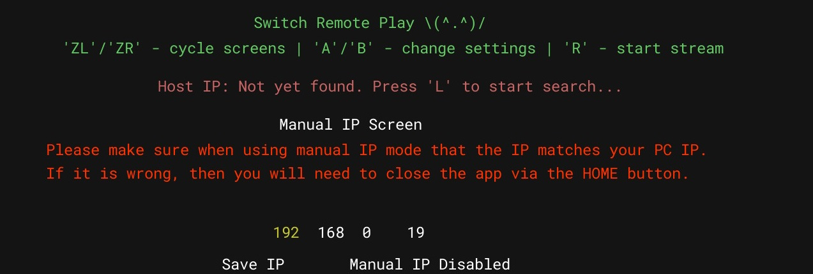

### Virus Threat Detected

**If the below instructions do not help, please see [this issue](https://github.com/Moehammered/switch-remote-play/issues/19) for more details and potential solutions.**

The release build seems to trigger more flags than the debug build.

My guess is due to the obfescation and the fact this program:

- keeps a socket open for broadcast listening (but I limit this to only the local subnet/network)
  - *windows-project -> main.cpp -> receiverProcedure*
- this program opens another process in the background(ffmpeg).
  - *windows-project -> FFMPEGHelper.cpp -> StartStream + StartAudio*

The source code is available and you are free to compile it yourself and check by downloading Visual Studio 2019.

If you can trust it then you will have to manually allow the program and get it out of quarantine with Windows Defender. And you **don't need to run this program as admin**.

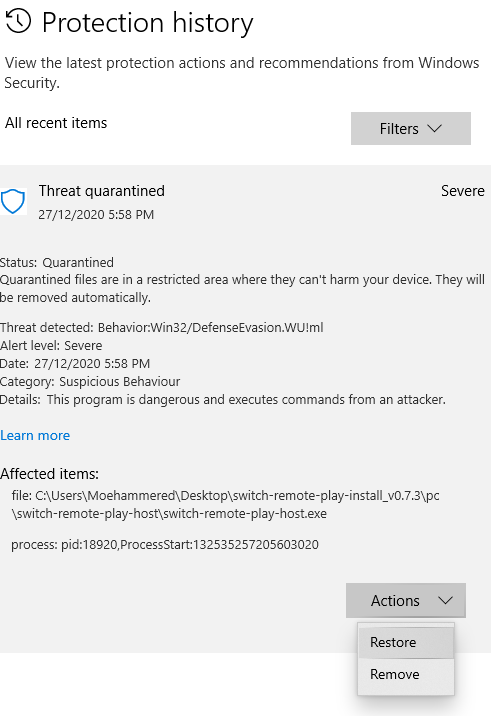

If anyone with any insight please contact me so I can learn how to remedy this issue.
