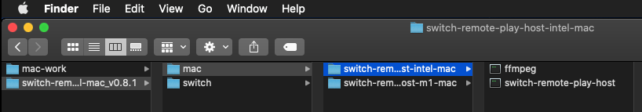
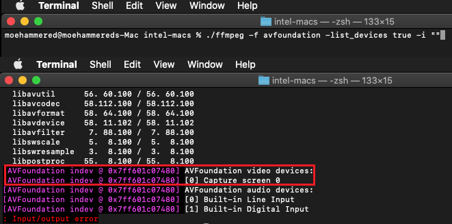
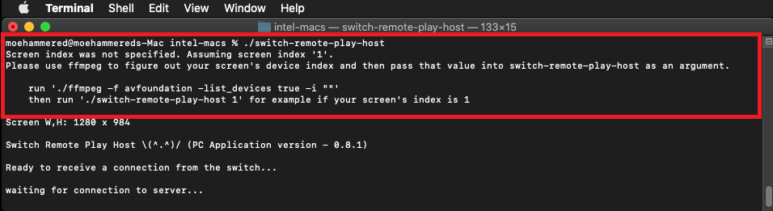
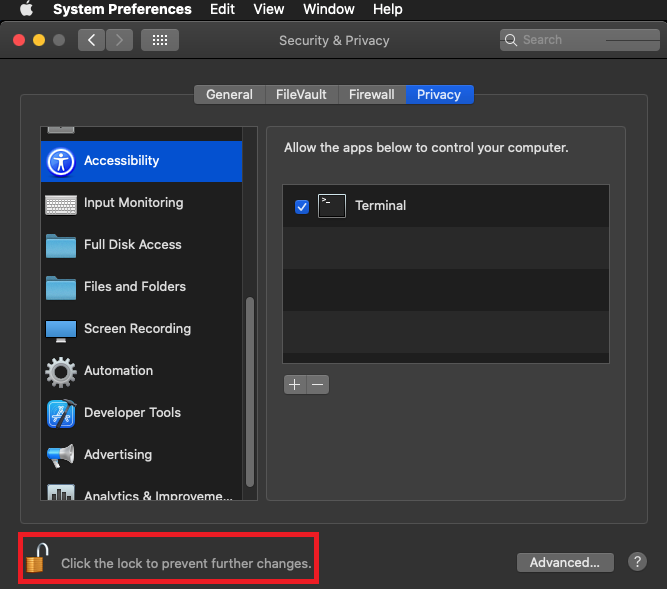
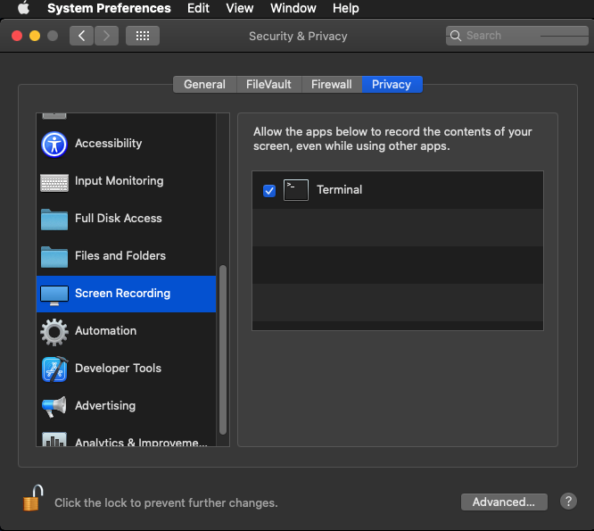

# How-To Mac OS X Instructions

## Install

### Switch Install

1. Have **[Atmosphere](https://github.com/Atmosphere-NX/Atmosphere/releases/latest)** CFW on your Switch *(other firmwares are untested)*
2. Copy the *switch* folder to the root directory of your Switch SD card

### Mac OS Install

1. Have Mac OS X 10.9 or newer

2. Copy the *switch-remote-play-host-[architecture]-mac* folder from the **Mac** folder to anywhere you like (Downloads, Desktop, Documents, etc...)
   1. If you're using an M1 Mac, copy the M1 mac version. If you're using an Intel Mac, copy the Intel mac version.

## Usage

### Mac Usage

0. Make sure your Mac and your Switch are connected on the **same network**
    - If you have a **5GHz WiFi network** try to make sure your Switch and Mac are connected to it

1. Make sure the *ffmpeg* program is located in the same folder as the *switch-remote-play-host* program
    - *ffmpeg* is used to stream the video to your switch
  
    

2. Open a terminal in the folder containing the switch-remote-play* and ffmpeg program
3. Use ffmpeg to list your hardware devices to figure out what number your screen is under ffmpeg
   

   - If you try to run switch-remote-play-host without specifying the screen number, you will get a warning
    

4. Run switch-remote-play-host from the terminal supplying your screen number
    - Example: *./switch-remote-play-host 0*
    - Once it is open, you should see *"Ready to receive a connection from the switch..."* and *"Waiting for connection to server"*
    - If you get a System Preferences prompt, open it and allow the program
      - If you don't allow access, the Switch will be unable to connect properly
  
    
    

### Switch Usage

0. Make sure **Flight Mode is OFF** and your Switch and PC are connected on the **same network**
    - If you have a **5GHz WiFi network** try to make sure your Switch and PC are connected to it

1. Open the *switch-remote-play* app
   - **Only v0.8.1 is supported!**

2. Press **'L'** to start network discovery
    - **NOTE:** Currently the network discovery requires a subnet mask of 255.255.255.0 and assumes your network gateway is 192.168.0.1
      - If you don't know what all this is please use **Manual IP Mode**.
    - **You should see your PC's IP address (*'Host IP: 192.168.XXX.XXX'* in green)**
    - **And you should see your Switch's IP on the PC application**
    - **If this doesn't work**, or stays stuck on *'Searching'* please close the app and open it again and use **Manual IP Mode**.

3. Press **'R'** to **connect**
    - Once connected, you can use the switch as a mouse on your Mac
      - If you get a System Preferences prompt, please allow the program.

4. To **stop** the stream, hold **'+'** button for more than 3 seconds

## Problems and Limitations

### This is a prototype

First and foremost, this is a prototype to just test the waters and see what can and can't be done. Mac OS poses a multitude of problems when getting simple functionality working. I spent a week making the prototype and it was very frustrating. Do not expect updates to the Mac version. The Windows and Linux version will have higher priority, with Windows being the highest priority. This is because there are too many obstacles with the Mac OS version.

The list of obstacles are:

- Mouse cursor doesn't show up despite enabling it in ffmpeg arguments
- Audio capture of system audio output is not possible unless using 3rd party application
- Simulating gamepad input is not feasible at all.
  - I couldn't find open source virtual gamepad libraries like ViGEm for Mac OS.
    - The closest is foohid, however it has vulnerabilities in it and by itself is just a (legacy now) driver that lets you 'define' a virtual device. The majority of the grunt work of simulating the virtual device is still required.
  - With Big Sur and onwards, Apple is pushing for the use of the DriverKit framework (which sounds great from what I've read but...)
    - There aren't any open source examples except for 1 that I found that virtualises a keyboard
    - You cannot develop a driver without disabling security on your system, setting developer mode on, and even then it will constantly request permissions when debugging
    - The developed driver needs to be signed in order to work on other user's Macs. This requires requesting entitlements from Apple.

To summarise all this: Mac OS requires software to simulate an audio output device for audio streaming, and a driver written in the DriverKit Framework to begin allowing simulating gamepad inputs. I am not interested whatsoever in writing a driver for DriverKit as it is pretty much undocumented aside from the 'overview' which just behaves as a sales pitch. Until sample code and proper examples are available in C++ I won't be considering it at all. I just don't have the time. Sorry.

### No Audio

There is no audio support. To get audio to work an extra program would need to be installed that would take the system audio in Mac OS X and output it as an audio device. As was shown when I ran the device list command, system audio is not listed.

Only audio input devices such as microphones are listed. I tested this on an M1 Macbook Air and a Mac OS X VM under Catalina.

### I can't play games

Sorry there is no gamepad support. Virtual Gamepad drivers do not exist for Mac OS. The closest is foohid but it is pretty much legacy and unsupported now (and doesn't work on M1 devices). Especially with Apple revving up to deprecate kexts in favor of their new DriverKit framework. If someone writes a virtual gamepad driver for Mac OS X with code examples for C++ then I'll re-visit the issue.

### I can't connect

- Please try using manual IP mode on the Switch app. Make sure to put your Mac's IP address correctly.
- If you've done this, then please make sure terminal is allowed access in the Security settings under System Preferences.

