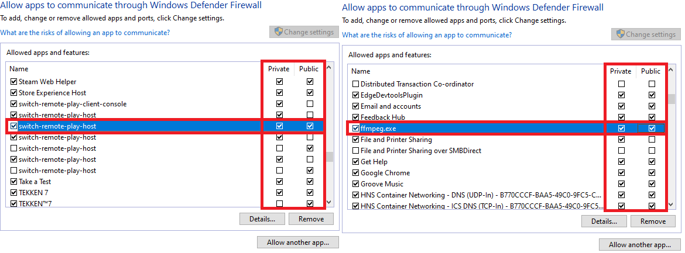
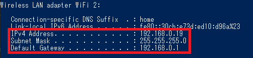
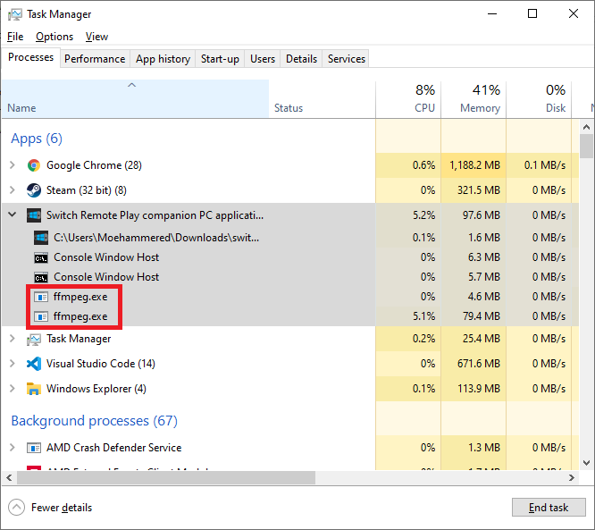

# Help

This page details some common issues and their respective solutions. Most issues can be solved by double checking the network configuration settings and ensuring Windows Security hasn't quarantined or deleted the program.

If this page fails to fix your issue, please check the [gbatemp release thread](https://gbatemp.net/threads/switch-remote-play-stream-your-pc-to-your-switch.579541/) to see if the issue has been solved by someone else. If your issue hasn't been solved then feel free to post in the thread for help and someone or myself will offer some help :)

## Connection Issues

### 1. Stuck on 'stream pending connection'

There can be a few issues that cause this, but they all boil down to the following:

* Switch and PC aren't on the same network
* Switch is using the wrong IP to connect to the PC
* PC program is not running
* PC program is blocked by Windows Firewall
* PC ports 19999 - 20004 are in use by another program
* PC program is deleted or quarantined by Windows Security
* ffmpeg received bad encoder options from the Switch

### Firewall

Please make sure the Windows Firewall has allowed switch-remote-play-host.exe and ffmpeg.exe.

If the program still fails to connect please make sure that Windows Security hasn't deleted the program.

### 2. I don't know my PC IP

When the program starts, it will display some network information. If for some reason it fails, there might be an issue with your network connection. However, if you're certain that your network connection is fine, then you can attempt to connect via manual IP still. To find your PC's IP address manually:

* Open command prompt or powershell
* type ipconfig then press Enter
* You should see a list of network interfaces. Look for the one that has IPv4 Address, Subnet Mask, and Default Gateway

* Use the IPv4 Address to connect via manual IP mode

### 3. Virus Thread Detected

The program triggers a virus detection due to the following:

1. The program has an open socket that listens for broadcasts
   * I limit this socket to only accepting local network traffic (so internet traffic cannot use it)

2. The program listens to a command send over a network to open ffmpeg.exe and run it in the background
   * This is to stream the video and audio to your Switch

I've been doing my best to stop Windows from flagging this program as a virus but I cannot circumvent it without spending some money and nagging the antivirus companies to whitelist the program.

So you will need to whitelist and approve the program in Windows Security. Please make sure you only download this program from this repository.

Go to the Windows Security Whitelist page to see how to whitelist the program.

### 4. Audio is bad

The following is known:

* Audio is bad or full of static and popping when played in docked mode
  * I cannot test this. My dock is connected to a monitor that has malfunctioning speakers.
* Audio sometimes is bad or sounds weird when played in handheld mode
  * This occurs from a previous audio stream failing to close

I have made this program with handheld mode entirely in mind. I barely test this in docked mode. I can't provide a remedy for docked mode at this time. If I ever get a new monitor with working speakers I will revisit the issue for docked audio. I have some theories I want to test for potential fixes, but these are low priority for me. In the meantime, please use it in handheld mode.

As for the handheld mode having odd audio these are the steps I use myself:

1. Stop the stream and restart the Switch app
2. Close the PC program and open it again
3. Check Task Manager to see if there is an 'ffmpeg.exe' process open and stop it
   * This will most likely be an old process from a previous audio stream that failed to close properly
   * Make sure to check the full Task Manager list just in case ffmpeg.exe is running in a background process

    

If the above doesn't solve it then restart your PC and close and re-open the Switch app and try again

If the above doesn't describe your issue, please check the [gbatemp release thread](https://gbatemp.net/threads/switch-remote-play-stream-your-pc-to-your-switch.579541/) as there were a couple users that had unique audio issues but they managed to solve them.
