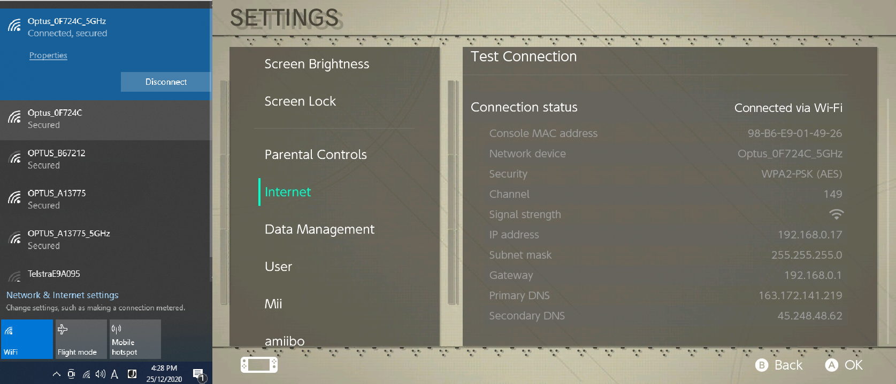
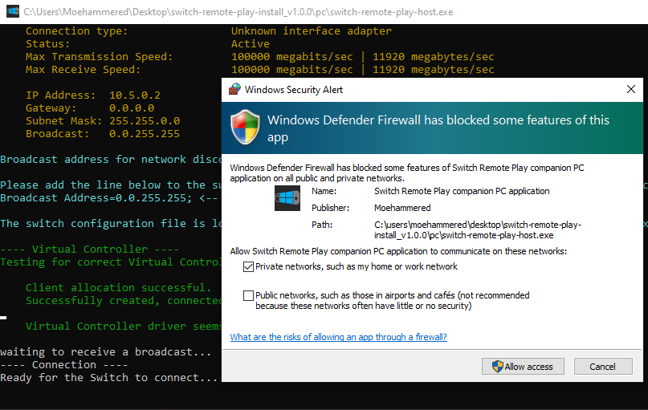
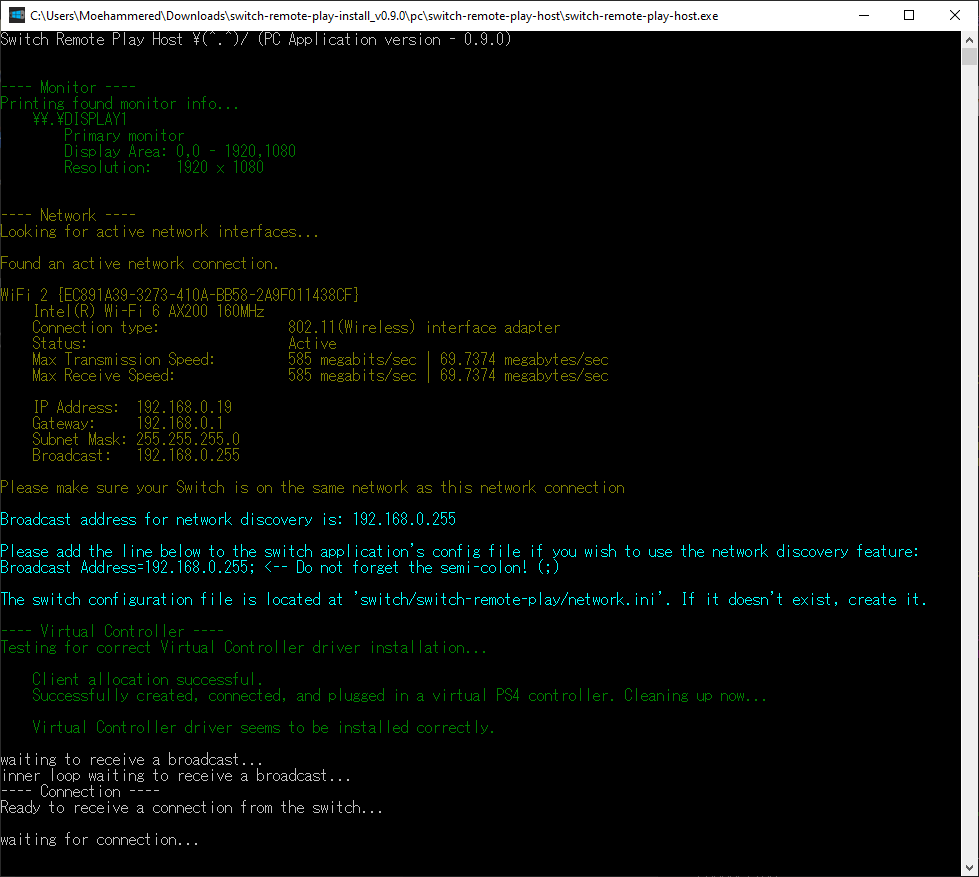

# PC Setup

This page describes how to setup and use the switch-remote-play-host.exe program to stream from your PC to your Switch.

## Important

The switch-remote-play-host.exe triggers a virus threat in Windows Defender. You'll need to whitelist the program to allow it and stop windows defender from deleting it. [See this issue for details on how to whitelist the program.](https://github.com/Moehammered/switch-remote-play/issues/19#issue-817003569)

0. Make sure your PC and your Switch are connected on the **same network**
    - If you have a **5GHz WiFi network** try to make sure your Switch and PC are connected to it

    

1. Make sure the *ffmpeg.exe* program is located in the same folder as the *switch-remote-play-host.exe*
    - *ffmpeg.exe* is used to stream the audio and video to your switch

    

2. Open the *switch-remote-play-host.exe* program
    - If you get a **Windows Firewall** prompt, make sure to **ALLOW** the program access
      - If you don't allow access, the Switch will be unable to connect. You will have to **manually** add *switch-remote-play-host.exe* to the **Windows Firewall** rules to fix this
    - Once it is open, you should see *"Ready to receive a connection from the switch..."* and *"Waiting for connection to server"*

    

3. The *switch-remote-play-host.exe* program will output basic diagnostic info. It will also output your **network configuration**. This is required to setup auto Network Discovery.

   
   - Please follow the instructions in the console to configure network discovery.
   - If the network diagnostic output fails or reports an issue, you will only be able to connect via Manual IP Mode.
