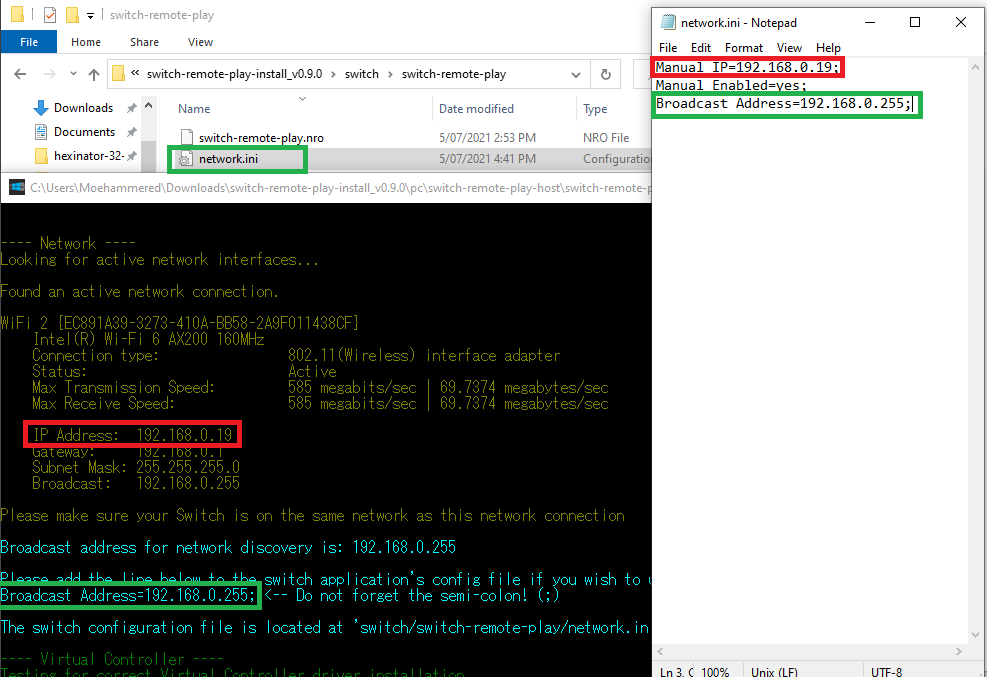
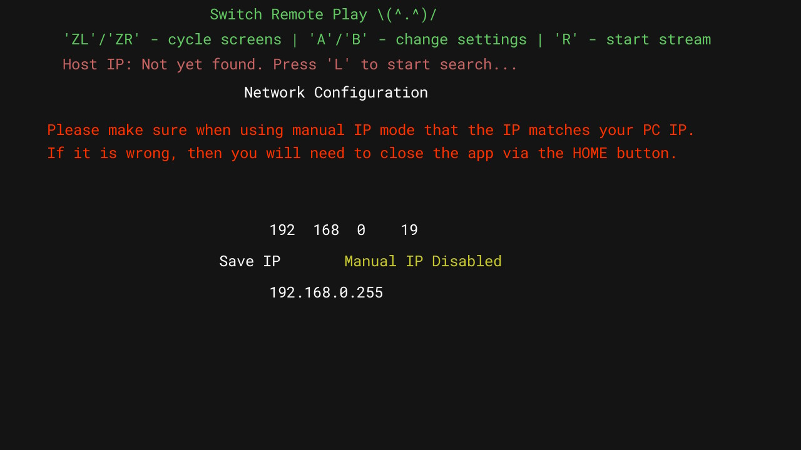
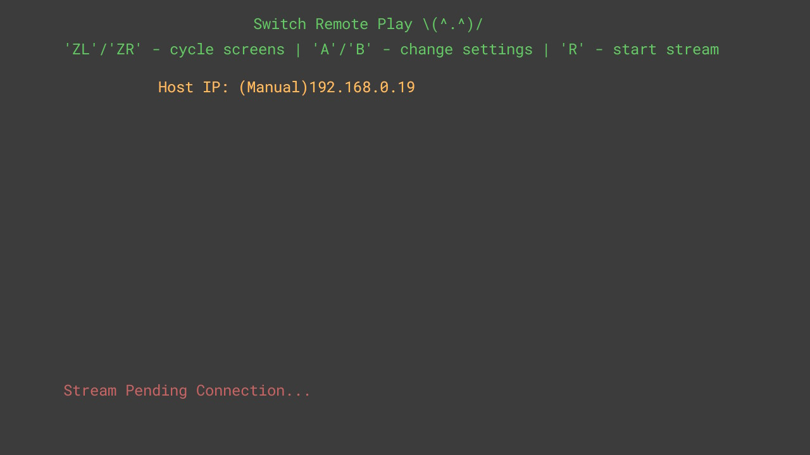
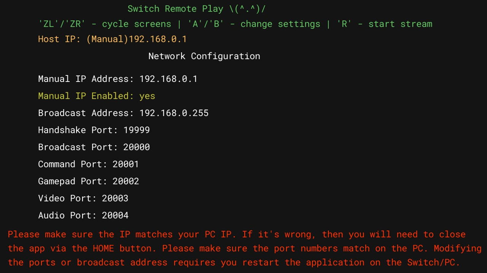

# Switch Setup

This page explains how to setup the switch-remote-play program on the Switch to stream your PC to the Switch.

## Network Configuration

You can configure manual IP network configuration entirely from the Switch app, however it is more convenient to do so on your PC before using the program on your Switch.

1. Open the pc program (switch-remote-play-host.exe) and scroll to the network diagnostics text

2. Go to the network.ini configuration file located at 'switch/switch-remote-play/network.ini'

    

3. Open the network.ini file

4. Replace the IP address of 'Manual IP=192.168.0.19;' with the IP address of your PC.
   * **Don't forget the ';' at the end of the line**

5. Replace the broadcast address of 'Broadcast Address=192.168.0.255;' with the broadcast address of your PC.
   * **Don't forget the ';' at the end of the line**

## In the Switch App

If you've done the above correctly, when you open the switch-remote-play app on your Switch and navigate to the network configuration screen (ZL/ZR to change screens) you should see your IP listed there as well as your broadcast address listed at the bottom.

I highly recommend you enable Manual IP and then test connecting. If it connects successfully then press 'Save IP' to save the manual IP enabled toggle to the config file so it will remember the next time you use the app. It is the most convenient way to use the application.

### If Manual IP is disabled

* Make sure the PC program is running
* Press 'L' on your Switch to start network discovery
* If it succeeds it will find your PC and automatically fill the IP address

* If you press 'R' on your Switch the stream should start and connect successfully
* If it stays on the grey pending connection screen it means something went wrong and it failed to connect. Please see the console output for details.

    

  * Double check that the PC program isn't deleted by Windows Security
  * Double check that the PC program is allowed through Windows Firewall
  * Double check that ffmpeg.exe and switch-remote-play-host.exe are in the same folder
  * Double check that the versions match for the PC and the Switch program!

* If it fails to find it, or is stuck on 'Searching...', please enable Manual IP

    

### If Manual IP is enabled

* Make sure the PC program is running
* Press 'R' on your Switch to start the stream
* If it stays on the grey pending connection screen it means something went wrong and it failed to connect. Please see the console output for details.
  * Double check that your Switch and PC are on the same network
  * Double check that the PC program isn't deleted by Windows Security
  * Double check that the IP address you put in matches your PC's IP address
  * Double check that the PC program is allowed through Windows Firewall
  * Double check that ffmpeg.exe and switch-remote-play-host.exe are in the same folder
  * Double check that the versions match for the PC and the Switch program!

* If it connected fine, then congratulations! Press 'Save IP' and you don't have to worry about network setup anymore :) *(until your PC's IP address changes...)*
