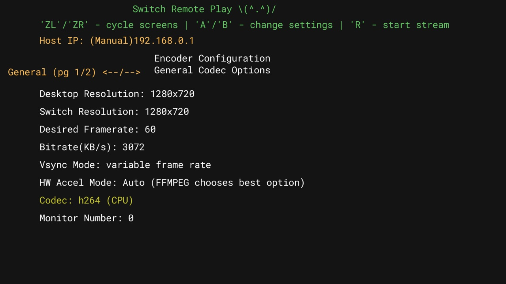
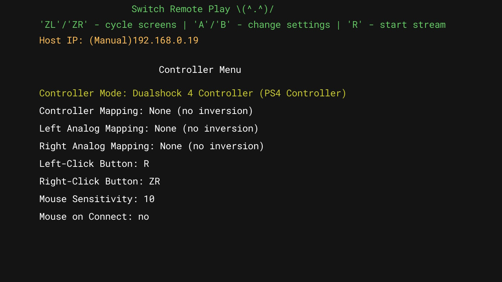

# Switch Setup

This page explains how to setup the switch-remote-play program on the Switch to stream your PC to the Switch. It does not explain the different settings and how to use them. This is just to get you started.

0. Make sure you have gone through the 'Switch Network Config Setup' page to configure the network settings for the program

1. Make sure Flight Mode is OFF and your Switch and PC are connected on the same network
   * If you have a 5GHz WiFi network try to make sure your Switch and PC are connected to it

2. Open the switch-remote-play app

3. Press 'ZL/ZR' to move between configuration screens. There is an 'Encoder Configuration' screen that lets you control the video stream options. Play around with them to control quality and latency.

    

    * **Note:** Quality and latency are entirely dependent on your machine and network. Please experiment with the configuration options to find what works for your machine.
    * You'll notice there are 2 pages on the 'Encoder Configuration' screen. The second page changes depending on the 'Codec' parameter. Currently only CPU and AMD codecs are implemented. Enjoy! :)

4. Press 'ZL/ZR' to move between configuration screens. There is a 'Controller Configuration' screen that lets you manage emulated controller and mouse settings. Please note the 'Mouse on Connect' setting.

    

   * If 'Mouse on Connect' is enabled, then the default control mode will be 'Mouse' mode when you connect to the PC.
     * Left-click and Right-click are 'R' and 'ZR' as shown in the screen shot. (This is configurable)
   * To toggle between the controller and mouse: Hold 'ZL+ZR+B' OR keep your finger on the touch-screen for more than 3 seconds.
     * You'll hear a sound play on the PC when it toggles

5. To stop the stream, hold the plus(+) button for more than 3 seconds
