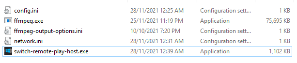
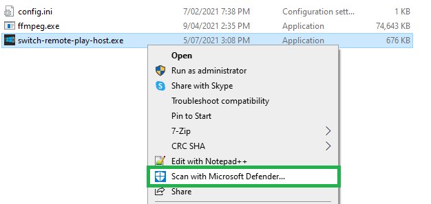
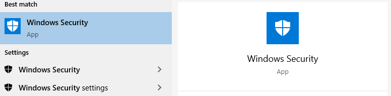
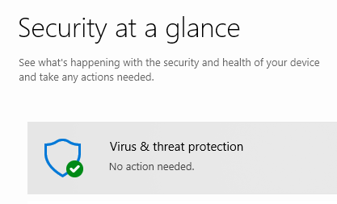
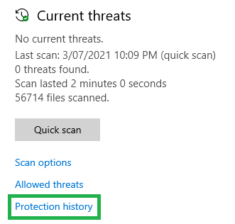

# Windows Security

This page shows you how to whitelist the program so Windows will not automatically block or delete it.

## Virus Thread Detected

The program triggers a virus detection due to the following:

1. The program has an open socket that listens for broadcasts
   * I limit this socket to only accepting local network traffic (so internet traffic cannot use it)

2. The program listens to a command send over a network to open ffmpeg.exe and run it in the background
   * This is to stream the video and audio to your Switch

I've been doing my best to stop Windows from flagging this program as a virus but I cannot circumvent it without spending some money and nagging the antivirus companies to whitelist the program.

So you will need to whitelist and approve the program in Windows Security. Please make sure you only download this program from this repository.

Before I show you how, please make sure to **read the important section below to understand why you should never download this program from anywhere except this repository.**

### Important

Because ffmpeg.exe is executed by a command from the Switch, it is vital that you NEVER download switch-remote-play-host from anywhere except this repository. Do not use a re-upload or user shared version. If for some reason you want to download a hosted version from somewhere else other than here, then I urge you:

* please make sure to download ffmpeg.exe from a link directly from the downloads section from the ffmpeg.org website or by going to [gyan.dev/ffmpeg/builds](https://www.gyan.dev/ffmpeg/builds/#release-section) and choosing the 'ffmpeg-release-essentials' download.
* Then take the downloaded ffmpeg.exe file from the reputable download locations and make sure to place it in the same directory as switch-remote-play-host.exe.

Why do all this? Because if someone replaces ffmpeg.exe with a dangerous executable then when you try to connect it will launch their potentially malicious software and cause you grief.

All this too much to take in? Then just make sure to only download the program from the releases page on this repo.

Now, on to how to whitelist the program in Windows Security.

### Windows Security Whitelist

The program will most likely be flagged as a virus and then be quarantined by Windows Security. You could whitelist a folder however that is very dangerous and a terrible idea. Instead, if you've never opened the program, right-click it and scan the file.

If you've already opened the program or it 'disappeared' then you will need to go to Windows Security and check your protection history to find it.

* Search for 'Windows Security' in the start menu

    

* Click on 'Virus and threat protection'

    

* Click on 'Protection History'
  
    

* If you see an entry of a threat quarantined or removed, you will need to click on it and 'Allow' or 'Restore'

    

* If you've successfully allowed it, then your protection history should have an entry showing that the program will be allowed or restored

    
